## 👨‍💻 Developer

**Nama:** Muhammad Irfan Fauzi 
**NIM:** 20230140136 
**Mata Kuliah:** Pengembangan Aplikasi Web  
**Dosen:** Ir. Asroni, S.T., M.Eng  
# Library System with Geolocation

Sistem manajemen perpustakaan berbasis web dengan fitur peminjaman buku yang dilengkapi tracking lokasi menggunakan geolocation. Proyek ini dibuat untuk memenuhi UCP 1 mata kuliah Pengembangan Aplikasi Web.

---

## 📋 Deskripsi Proyek

Aplikasi ini merupakan sistem perpustakaan yang memiliki fitur:
- **CRUD Buku** (Create, Read, Update, Delete) untuk Admin
- **Peminjaman Buku** dengan tracking lokasi (latitude & longitude) untuk User
- **Role-based Access Control** menggunakan header HTTP
- **Interactive Map** untuk visualisasi lokasi peminjaman
- **RESTful API** dengan Express.js dan Sequelize ORM

---

## 🛠️ Teknologi yang Digunakan

### Backend
- **Node.js** - Runtime JavaScript
- **Express.js** - Web framework
- **Sequelize ORM** - Database ORM
- **MySQL** - Database
- **dotenv** - Environment variables

### Frontend
- **HTML5** - Struktur halaman
- **CSS3** - Styling dengan glassmorphism effect
- **JavaScript (Vanilla)** - Logic dan API integration
- **Leaflet.js** - Interactive maps

---

## 📁 Struktur Proyek

```
library_system/
├── backend/
│   ├── config/
│   │   └── database.js          # Konfigurasi Sequelize
│   ├── controllers/
│   │   ├── bookController.js    # Logic CRUD buku
│   │   └── borrowController.js  # Logic peminjaman
│   ├── middleware/
│   │   ├── roleCheck.js         # Validasi role
│   │   └── errorHandler.js      # Error handling
│   ├── models/
│   │   ├── Book.js              # Model buku
│   │   ├── BorrowLog.js         # Model log peminjaman
│   │   └── index.js             # Model associations
│   ├── routes/
│   │   ├── bookRoutes.js        # Routes buku
│   │   └── borrowRoutes.js      # Routes peminjaman
│   ├── .env                     # Environment variables
│   ├── .gitignore               # Git ignore
│   ├── package.json             # Dependencies
│   └── server.js                # Entry point
├── frontend/
│   ├── assets/
│   │   └── philosophers_hero.png # Hero image
│   ├── index.html               # Main HTML
│   ├── style.css                # Styling
│   └── app.js                   # Frontend logic
├── ss/                          # Screenshots
└── README.md                    # Dokumentasi (file ini)
```

---

## ⚙️ Instalasi dan Konfigurasi

### 1. Prerequisites

Pastikan sudah terinstall:
- **Node.js** (v14 atau lebih baru)
- **MySQL** (v5.7 atau lebih baru)
- **npm** (biasanya sudah include dengan Node.js)

### 2. Clone Repository

```bash
git clone <repository-url>
cd library_system
```

### 3. Setup Database

1. Buka MySQL dan buat database baru:
```sql
CREATE DATABASE library_system;
```

2. Catat kredensial MySQL Anda (host, port, user, password)

### 4. Setup Backend

```bash
# Masuk ke folder backend
cd backend

# Install dependencies
npm install

# Buat file .env
# Copy dari .env.example atau buat manual
```

**Isi file `.env`:**
```env
# Server Configuration
PORT=3000
NODE_ENV=development

# Database Configuration
DB_HOST=localhost
DB_PORT=3309
DB_NAME=library_system
DB_USER=root
DB_PASSWORD=your_password_here
DB_DIALECT=mysql
```

> **Catatan:** Sesuaikan `DB_PORT`, `DB_USER`, dan `DB_PASSWORD` dengan konfigurasi MySQL Anda.

### 5. Migrasi Database

Database akan otomatis ter-migrate saat pertama kali menjalankan server. Sequelize akan membuat tabel `books` dan `borrow_logs` secara otomatis.

---

## 🚀 Cara Menjalankan Aplikasi

### 1. Jalankan Backend

```bash
# Dari folder backend
npm start
```

Server akan berjalan di `http://localhost:3000`

**Output yang diharapkan:**
```
✅ Database connected successfully
✅ Database synchronized
🚀 Server running on port 3000
```

### 2. Buka Frontend

Ada beberapa cara:

**Opsi 1: Double-click**
- Buka file `frontend/index.html` langsung di browser

**Opsi 2: Live Server (VS Code)**
- Klik kanan pada `index.html`
- Pilih "Open with Live Server"

**Opsi 3: Python HTTP Server**
```bash
cd frontend
python -m http.server 8000
# Buka http://localhost:8000
```

---

## 📖 Cara Menggunakan Aplikasi

### Mode User (Default)

1. **Melihat Koleksi Buku**
   - Semua buku ditampilkan dalam grid cards
   - Informasi: Judul, Author, Stock

2. **Meminjam Buku**
   - Klik tombol "🙏 Borrow" pada buku yang tersedia
   - Masukkan User ID Anda
   - Izinkan akses lokasi saat diminta
   - Map akan menampilkan lokasi Anda
   - Klik "Borrow Book" untuk konfirmasi
   - Lokasi akan tersimpan di database

### Mode Admin

1. **Switch ke Mode Admin**
   - Klik tombol "⚜️ Admin" di navigation bar

2. **Menambah Buku Baru**
   - Scroll ke "Admin Sanctuary"
   - Isi form: Title, Author, Stock
   - Klik "✨ Add to Collection"

3. **Edit Buku**
   - Klik tombol "✏️ Edit" pada buku
   - Ubah data yang diperlukan
   - Klik "💫 Update Book"

4. **Hapus Buku**
   - Klik tombol "🗑️ Delete" pada buku
   - Konfirmasi penghapusan

---

## 🔌 API Endpoints

### Public Endpoints

| Method | Endpoint | Deskripsi |
|--------|----------|-----------|
| GET | `/api/books` | Mendapatkan semua buku |
| GET | `/api/books/:id` | Mendapatkan detail buku |

### Admin Endpoints

**Header Required:** `x-user-role: admin`

| Method | Endpoint | Deskripsi | Body |
|--------|----------|-----------|------|
| POST | `/api/books` | Tambah buku baru | `{ title, author, stock }` |
| PUT | `/api/books/:id` | Update buku | `{ title, author, stock }` |
| DELETE | `/api/books/:id` | Hapus buku | - |

### User Endpoints

**Headers Required:**
- `x-user-role: user`
- `x-user-id: [user_id]`

| Method | Endpoint | Deskripsi | Body |
|--------|----------|-----------|------|
| POST | `/api/borrow` | Pinjam buku | `{ bookId, latitude, longitude }` |

---

## 🗄️ Struktur Database

### Tabel: `books`

| Field | Type | Constraints |
|-------|------|-------------|
| id | INT | PRIMARY KEY, AUTO_INCREMENT |
| title | VARCHAR(255) | NOT NULL |
| author | VARCHAR(255) | NOT NULL |
| stock | INT | DEFAULT 0 |
| createdAt | DATETIME | AUTO |
| updatedAt | DATETIME | AUTO |

### Tabel: `borrow_logs`

| Field | Type | Constraints |
|-------|------|-------------|
| id | INT | PRIMARY KEY, AUTO_INCREMENT |
| userId | INT | NOT NULL |
| bookId | INT | FOREIGN KEY → books(id) |
| borrowDate | DATETIME | DEFAULT NOW() |
| latitude | FLOAT | NOT NULL |
| longitude | FLOAT | NOT NULL |
| createdAt | DATETIME | AUTO |
| updatedAt | DATETIME | AUTO |

**Relasi:**
- `borrow_logs.bookId` → `books.id` (Many-to-One)

---

## 📸 Screenshot Aplikasi

### 1. Test Endpoint API (Postman)

#### GET All Books
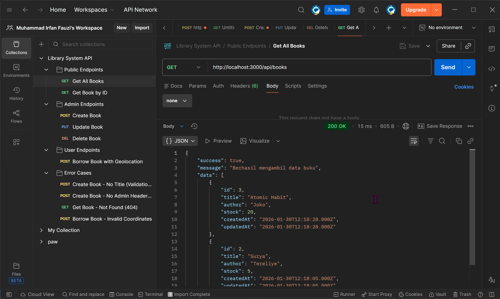

#### GET Book by ID
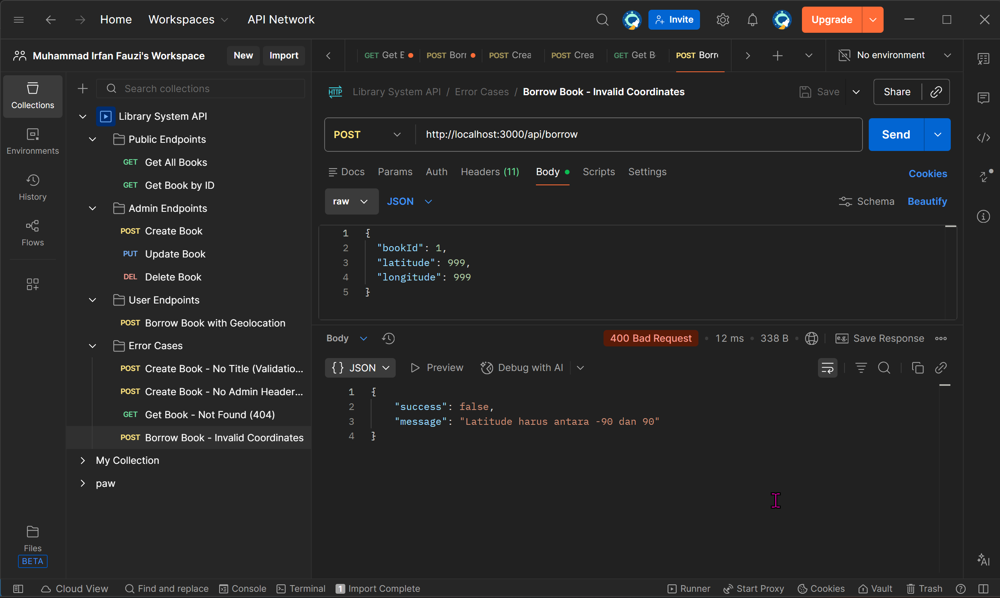

#### POST Add Book (Admin)
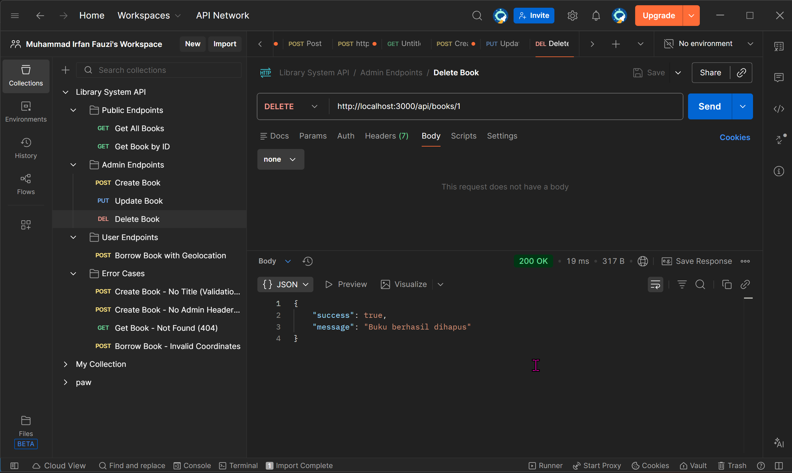

#### PUT Update Book (Admin)
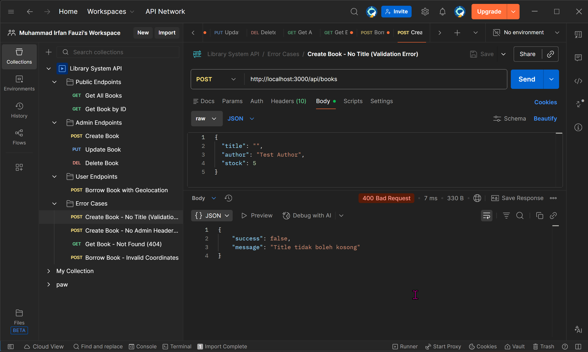

#### DELETE Book (Admin)
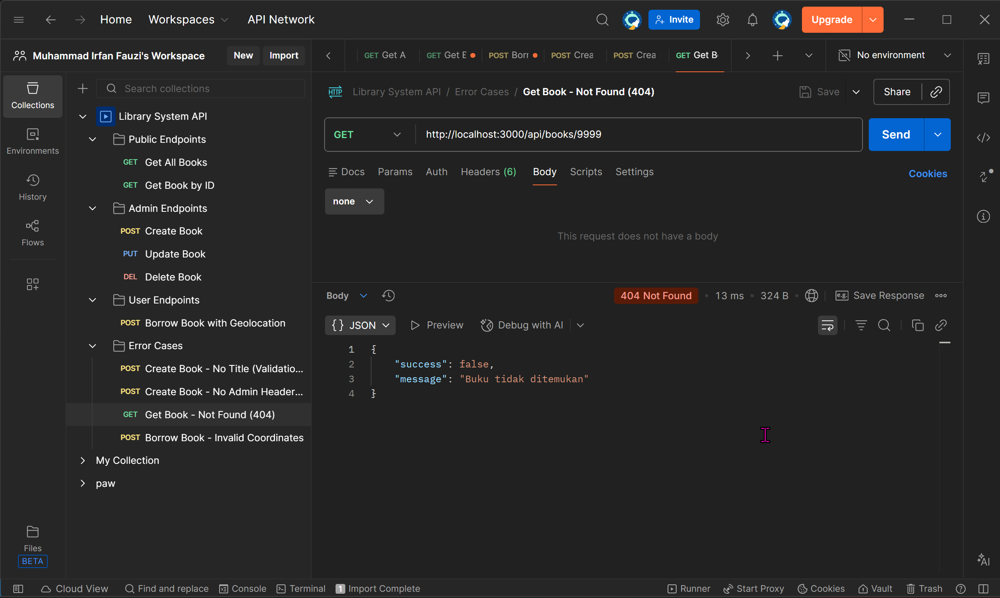

#### POST Borrow Book (User)
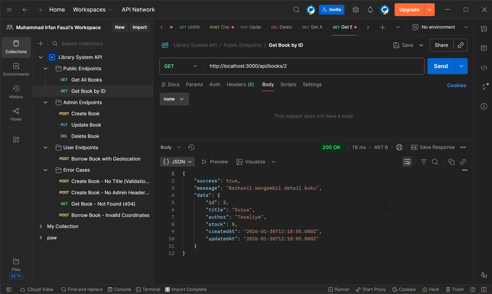

#### Borrow Response with Geolocation
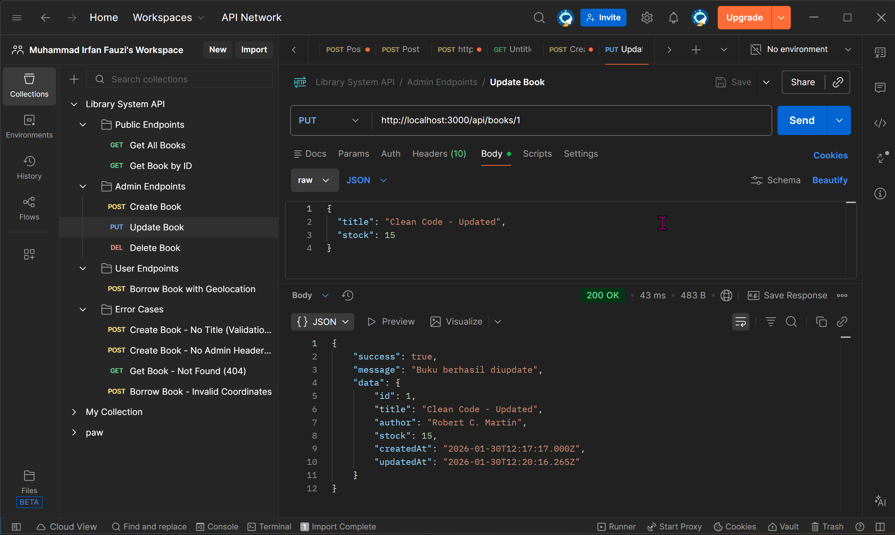

#### Additional API Tests
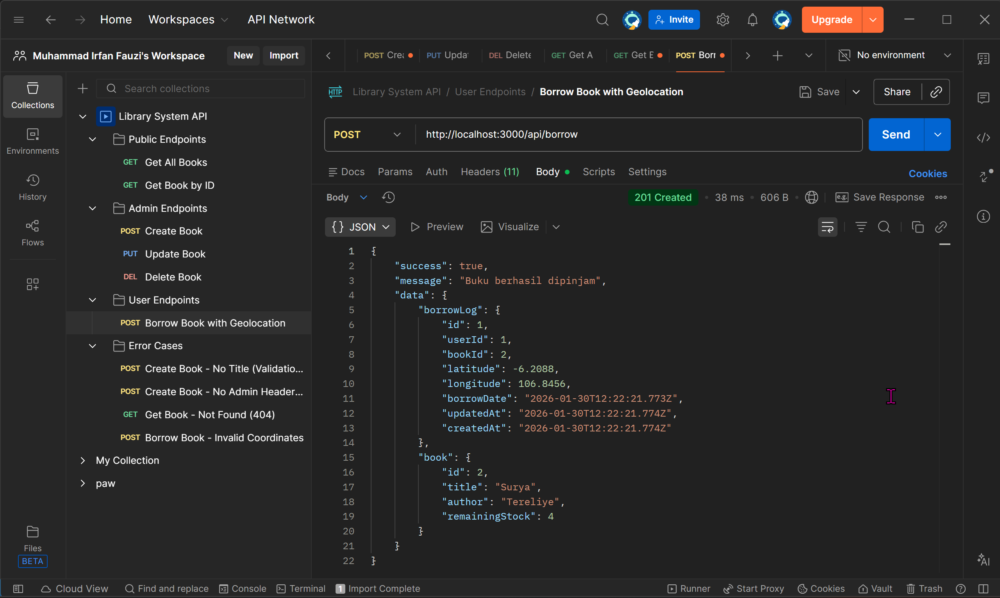
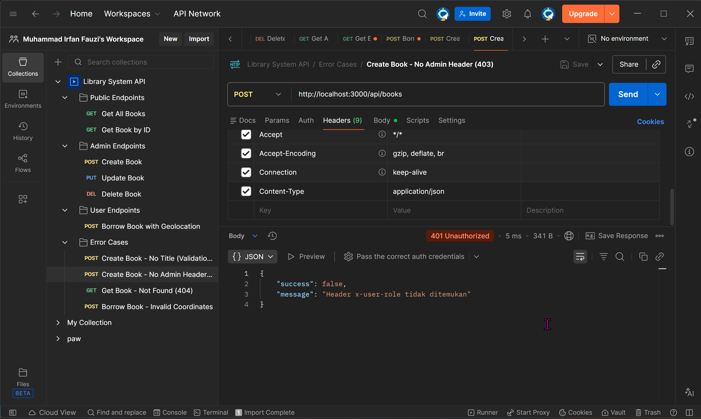
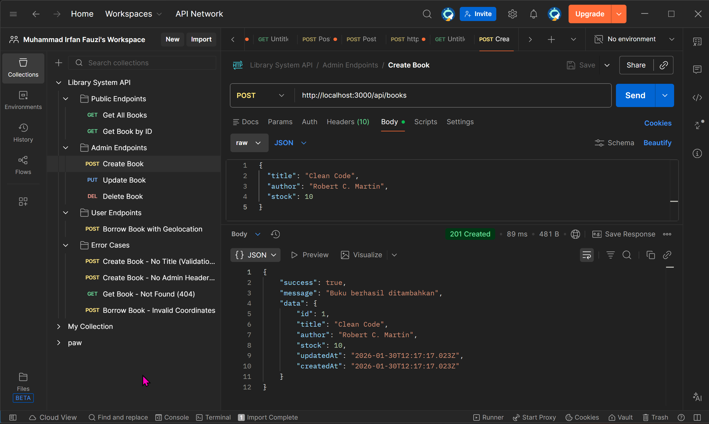

---

### 2. Tampilan Web

#### Homepage - Hero Section
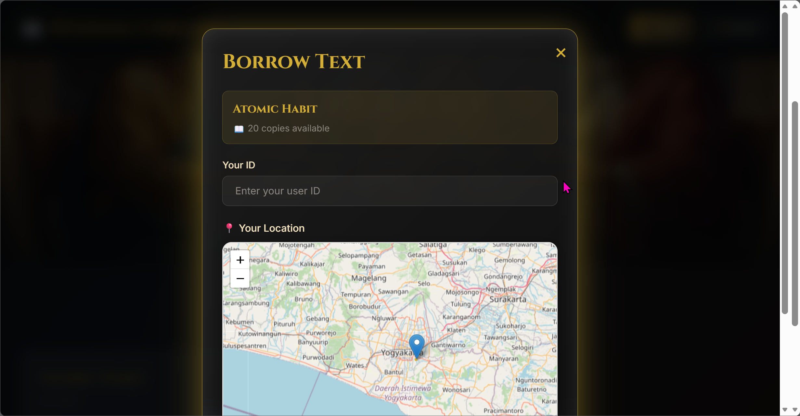

#### Books Collection Grid
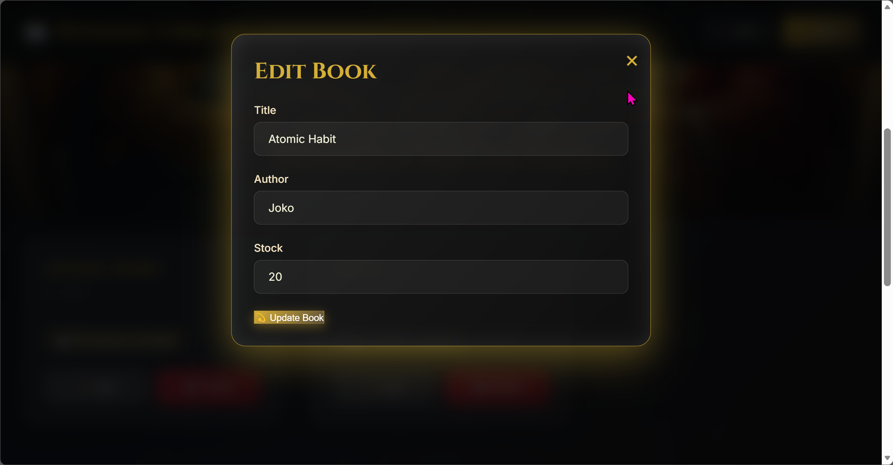

#### Borrow Modal with Map
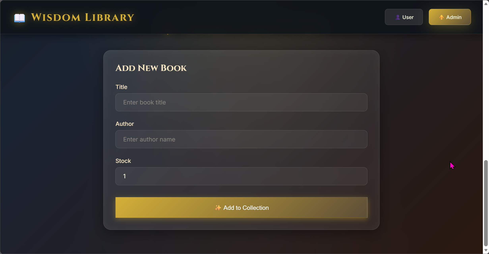

#### Admin Panel
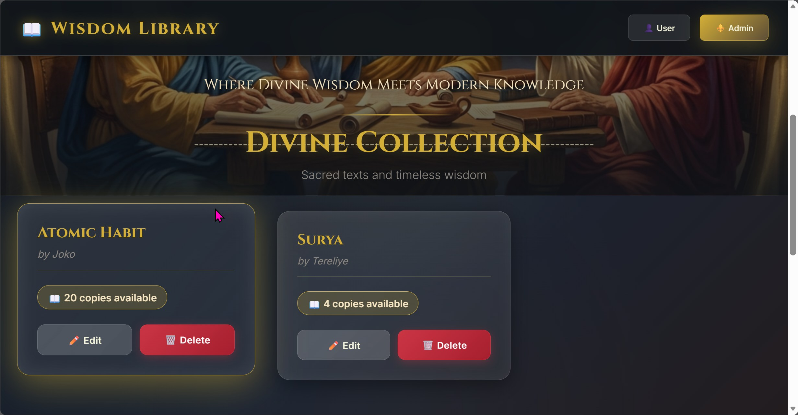

#### User Interface


#### Edit Modal
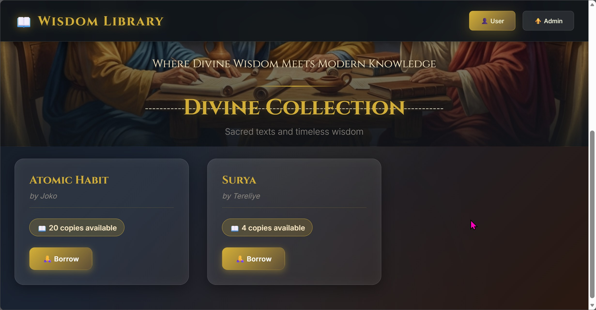

---

### 3. Struktur Database

#### Books Table Structure
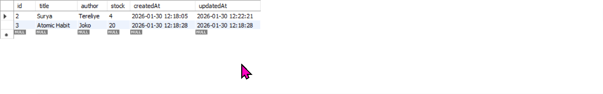

#### Borrow Logs Table Structure
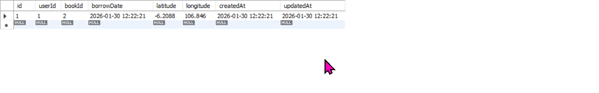

---

## 🧪 Testing

### Manual Testing dengan Postman

1. **Import Collection**
   - Buka Postman
   - Import file `backend/Library_System_API.postman_collection.json`

2. **Test Endpoints**
   - Jalankan request satu per satu
   - Perhatikan response dan status code
   - Verifikasi data di database

### Testing di Browser

1. **Test Mode User:**
   - Buka aplikasi
   - Coba borrow buku
   - Izinkan akses lokasi
   - Cek map menampilkan lokasi dengan benar

2. **Test Mode Admin:**
   - Switch ke mode Admin
   - Tambah buku baru
   - Edit buku existing
   - Hapus buku

3. **Verifikasi Database:**
   - Buka MySQL Workbench
   - Check tabel `books` dan `borrow_logs`
   - Pastikan data tersimpan dengan benar

---
